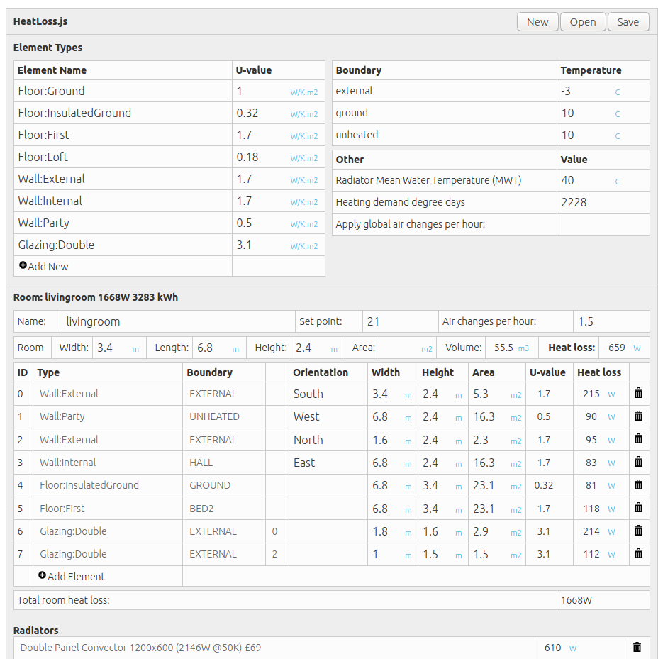

# HeatLossJS

A small open source room by room heat loss calculator

Create html page, load heatloss.js tool with the following:

    
    
    
    
    
    <link rel="stylesheet" type="text/css" href="heatlossjs/style.css" />
    

    
    
Define your building in json object input definition (loaded in the first line above).

Examples: 

- [midterrace_data.js](files/midterrace_data.js)
- [bothylab_data.js](files/bothylab_data.js)
- [mainhouse_data.js](files/mainhouse_data.js)
- [study_data.js](files/study_data.js)

Examples with notes on input values:

- [Mid Terrace house](https://trystanlea.org.uk/roombyroomheatloss2)
- [Bothy](https://trystanlea.org.uk/bothy)
- [Detached house](https://trystanlea.org.uk/house)

### Heatlossjs adaptations and forks

- **heatlossjsITA** An Italian adaptation of heatlossjs developed by @jumpjack. New features include taking into account different rates of heat loss from external walls depending on orientation as well as translation to Italian. https://github.com/jumpjack/heatlossjsITA
